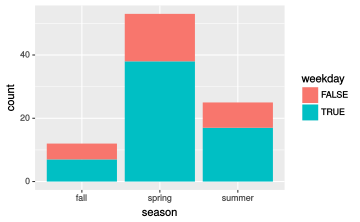

Visualization Homework: Rail Trail
================
Due: Month Day, Year @ Time

## Instructions

Use the R Markdown file `visualization_homework.Rmd` to do your work and
write-up when completing the questions below. Remember to fill in your
name at the top of the R Markdown document and be sure to save, commit,
and push (upload) frequently to Github so that you have incremental
snapshots of your work. When you’re done, follow the [How to
submit](#how-to-submit) section below to setup a Pull Request, which
will be used for feedback.

  - Remember that the point of us using RMarkdown documents is to
    combine code and writeups\! Each block of R code should have some
    sort of explanation or justification using full sentences.

  - **Your grade will take into account your code, your explanations,
    and whether your document looks nice when “knitted” to
PDF**.

## The rail trail dataset


For this homework assignment, you will be working though a set of
visualization problems based on the `rail_trail` dataset. The
`rail_trail` dataset was collected by the Pioneer Valley Planning
Commission (PVPC) and counts the number of people that walked through a
sensor on a *rail trail* during a ninety day period. [A *rail trail* is
a retired or abandoned railway that was converted into a walking
trail](https://wikipedia.org/wiki/Rail_trail). The data was collected
from April 5, 2005 to November 15, 2005 using a laser sensor placed at a
location north of Chestnut Street in Florence,
MA.


The dataset contains the following
variables:

| Variable     | Description                                                             |
| :----------- | :---------------------------------------------------------------------- |
| `hightemp`   | daily high temperature (in degrees Fahrenheit)                          |
| `lowtemp`    | daily low temperature (in degrees Fahrenheit)                           |
| `avgtemp`    | average of daily low and daily high temperature (in degrees Fahrenheit) |
| `season`     | indicates whether the season was Spring, Summer, or Fall                |
| `cloudcover` | measure of cloud cover (in oktas)                                       |
| `precip`     | measure of precipitation (in inches)                                    |
| `volume`     | estimated number of trail users that day (number of breaks recorded)    |
| `weekday`    | indicator of whether the day was a non-holiday weekday                  |

## How to describe your visualizations

When describing the contents of a visualization, follow the ideas
discussed in these resources:

  - [*Describing univariate and bivariate
    data*](http://book.cds101.com/describing-numerical-data.html)

  - [*Data visualization - Examining numerical data*
    slides](http://fall18.cds101.com/doc/week04_data_visualization_02_examining_numerical_data.pdf)

## Questions

1.  In the `rail_trail` dataset, how many rows are there? How many
    columns? Which variables in the dataset are continuous/numerical and
    which are categorical?

2.  Create a histogram of the variable `volume` using the following
    code:
    
    ``` r
    ggplot(data = rail_trail) +
      geom_histogram(mapping = aes(x = volume))
    ```
    
    Describe the *shape* and *center* of the distribution. Afterward,
    try adjusting the size of the histogram bins by adding the
    `binwidth` input. To start with, use `binwidth = 21`. If you need
    help with where to place `binwidth`, read the documentation by
    running `?geom_histogram` in your *Console* window. Then, find a
    binwidth that’s too narrow and another one that’s too wide to
    produce a meaningful histogram.

3.  Choosing a proper bin width for a histogram can be tricky, and for
    that reason it’s preferable to use visualizations that avoid using
    bin widths when possible. An easy-to-use alternative to the
    histogram is `geom_density`, which creates a **density plot**. Use
    `geom_density` to create a density plot of the variable `volume`.

4.  Create a density plot for each of the remaining numerical variables,
    and describe the *shape* and *center* of each distribution. Are
    there any distributions that are similar in *shape* to each other?

5.  Use `geom_point()` to create a scatterplot that plots `weekday`
    versus `season`. Why is this plot not useful?

6.  Create a `geom_count()` plot (an alternative to a mosaic plot) using
    the same variables you considered in question 5:
    
    ``` r
    ggplot(data = rail_trail) +
      geom_count(mapping = aes(x = season, y = weekday))
    ```
    
    Which circle in the plot takes up the most area? Explain the meaning
    of the different size circles in the plot and what information it
    contains that is missing in the previous scatter plot.

7.  Run `?geom_bar` in the *Console* window and read the documentation
    for `geom_bar()`, and then look at the entry for it on the [ggplot2
    cheatsheet](https://github.com/rstudio/cheatsheets/raw/master/data-visualization-2.1.pdf)
    Use `geom_bar()` to reproduce the following bar
    chart:
    
    
    
    After reproducing the plot, explain what the height of each bar
    means.

8.  Starting from the code snippet you deduced in question 7, create two
    more bar charts:
    
      - Create a bar chart by supplying the input `position = "dodge"`
        to `geom_bar()`
    
      - Create a bar chart by supplying the input `position = "fill"` to
        `geom_bar()`.
    
    After creating the visualizations, describe the feature that
    `position` controls.

9.  Create a bar chart that maps its aesthetic `aes()` to `precip > 0`.
    Interpret what this bar chart means.

10. Create a scatter plot of `volume` versus `hightemp` using
    `geom_point()`. Describe any trends that you see.

11. Take the code snippet you wrote for question 10 and map the
    `weekday` variable to `color`. Then create a second plot where,
    instead of mapping `weekday` to `color`, you *facet* over `weekday`
    using either `facet_wrap()` or `facet_grid()`. Discuss the
    advantages and disadvantages to faceting instead of mapping to the
    `color` aesthetic. How might the balance change if you had a larger
    dataset?

12. Take the code snippet that you wrote down in question 11 that
    faceted over `weekday` and create a model for each facet panel using
    `geom_smooth()`. Discuss the trends in the number of rail trail
    users that `geom_smooth()` picks up.

13. Copy the code snippet you deduced in question 12 and use the input
    `se = FALSE` for `geom_smooth()`. What does the `se` input option
    for `geom_smooth()` control?

## How to submit

When you are ready to submit, be sure to save, commit, and push your
final result so that everything is synchronized to GitHub. Then, knit
your R Markdown document to PDF, export (download) the file from RStudio
Server, and upload it to the Visualization Homework posting on
Blackboard.

You are to also open a Pull Request on GitHub so that comments can be
directly left on your R Markdown source files. After uploading to
Blackboard, navigate to **your copy** of the GitHub repository you used
for this assignment. You should see your repository, along with the
updated files that you synchronized to GitHub. Do the following:

1.  Click the *Pull Requests* tab near the top of the page.

2.  Click the green button that says “New pull request”.

3.  Click the dropdown menu button labeled “base:”, and select the
    option `grading`.

4.  Confirm that the dropdown menu button labeled “compare:” is set to
    `master`.

5.  Click the green button that says “Create pull request”.

6.  Give the *pull request* the following title: `Submission:
    Visualization Homework, FirstName LastName`, replacing `FirstName`
    and `LastName` with your actual first and last name.

7.  In the messagebox, write: `My homework submission is ready for
    grading @instructor_username`.

8.  Click “Create pull request” to lock in your submission.

## Cheatsheets

You are encouraged to review and keep the following cheatsheets handy
while working on this assignment:

  - [RStudio
    cheatsheet](https://github.com/rstudio/cheatsheets/raw/master/rstudio-ide.pdf)
  - [RMarkdown
    cheatsheet](https://github.com/rstudio/cheatsheets/raw/master/rmarkdown-2.0.pdf)
  - [RMarkdown
    reference](https://www.rstudio.com/wp-content/uploads/2015/03/rmarkdown-reference.pdf)
  - [`ggplot2`
    cheatsheet](https://github.com/rstudio/cheatsheets/raw/master/data-visualization-2.1.pdf)
